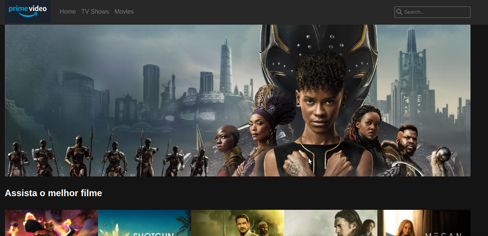
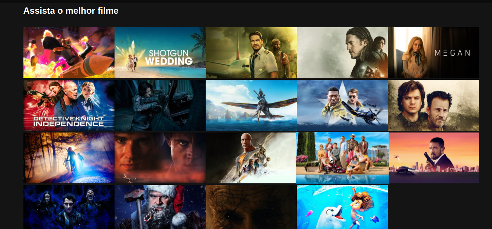

<h1 align="center">
  
  

</h1>

#  Proteto Clone Prime Vídeo | MENTORIA 🚀 
 O objetivo do projeto foi treinar habilidades em HTML, CSS E JS. 
 Com consumo de API.

Feito com 💜 por Anne Caroline Fonseca

